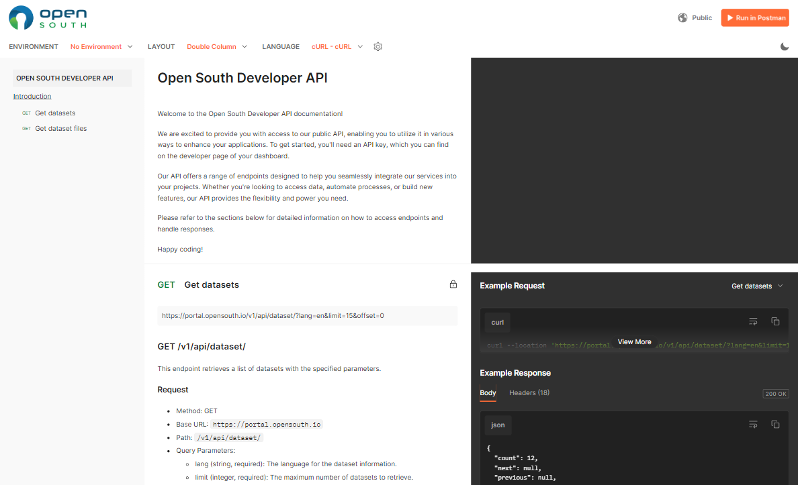

## API Overview

The Open South API provides developers with programmatic access to datasets available on the Open South platform. This API allows for seamless integration of Open South data into applications, services, and research projects, enabling automated data retrieval and analysis. Our API is designed to be easy to use, secure, and scalable, supporting a wide range of use cases from simple data queries to complex data manipulation tasks.

## Accessing the API

The Open South API is available at the following endpoint: [Open South API Documentation](https://documenter.getpostman.com/view/23812062/2sA3dyjBdN)



## Key Features

1. **Data Retrieval:** Access detailed datasets across various categories.
2. **Search and Filter:** Apply search queries and filters to retrieve specific data points.
3. **Data Integration:** Integrate Open South data into your applications, websites, or research tools.
4. **Real-time Data:** Access up-to-date data for real-time applications and analysis.

## Authentication

To use the API, you must authenticate your requests. Authentication is typically done via API keys, which you can obtain by creating an account on the Open South platform and generating an API key from your profile settings.

1. **Obtaining an API Key:**

   - Log in to your Open South account.
   - Navigate to 'Profile Settings' and select 'API Keys.'
   - Click 'Generate New API Key' and copy the key provided.

2. **Using the API Key:**

   - Include your API key in the request headers as follows:

     `Authorization: Bearer YOUR_API_KEY`

## API Endpoints

1. **Get All Datasets:**

   - **Endpoint:** `/datasets`
   - **Method:** `GET`
   - **Description:** Retrieve a list of all datasets available on the platform.
   - **Example Request:**
     ```
     GET /datasets HTTP/1.1
     Host: api.opensouth.io
     Authorization: Bearer YOUR_API_KEY
     ```

2. **Get Dataset by ID:**

   - **Endpoint:** `/datasets/{id}`
   - **Method:** `GET`
   - **Description:** Retrieve detailed information about a specific dataset.
   - **Example Request:**
     ```
     GET /datasets/12345 HTTP/1.1
     Host: api.opensouth.io
     Authorization: Bearer YOUR_API_KEY
     ```

3. **Search Datasets:**

   - **Endpoint:** `/datasets/search`
   - **Method:** `GET`
   - **Description:** Search for datasets based on specific criteria such as keywords, tags, and date ranges.
   - **Parameters:**
     - `query:` Search query (string)
     - `tags:` Filter by tags (comma-separated list)
     - `start_date` and `end_date:` Filter by date range (YYYY-MM-DD)
   - **Example Request:**
     ```
     GET /datasets/search?query=health&tags=africa,2023&start_date=2023-01-01&end_date=2023-12-31 HTTP/1.1
     Host: api.opensouth.io
     Authorization: Bearer YOUR_API_KEY
     ```

## Example Use Cases

1. **Integrating Data into a Website:**

   - Use the API to fetch the latest datasets and display them on your website, allowing visitors to interact with the data directly.

2. **Automating Data Analysis:**

   - Leverage the API to automate the retrieval of datasets for regular analysis, reducing manual data handling and increasing efficiency.

3. **Building Data-Driven Applications:**

   - Create applications that utilize Open South data to provide insights, visualizations, or decision-making tools for users.

## Error Handling

The API uses standard HTTP status codes to indicate the success or failure of an API request. Common status codes include:

- `200 OK`: The request was successful.
- `400 Bad Request`: The request was invalid or cannot be served.
- `401 Unauthorized`: Authentication failed or the API key is missing.
- `404 Not Found`: The requested resource could not be found.
- `500 Internal Server Error`: An error occurred on the server.

## Support and Feedback

For any issues, questions, or feedback regarding the Open South API, please contact our support team at [support@opensouth.io](mailto:support@opensouth.io) or send us a message via the contact form.
