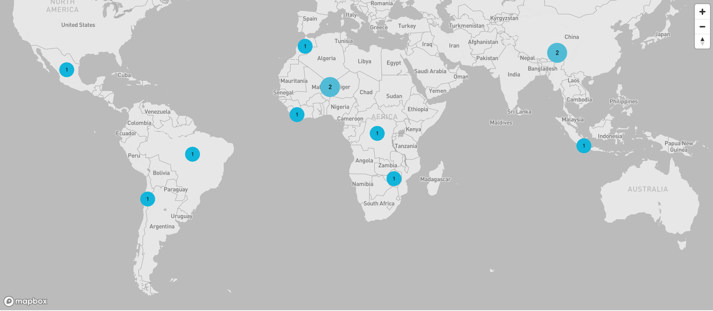

- **Visualizing dataset on Maps:** Instructions for visualizing data on maps.

  - To visualize the map, navigate to the homepage and click on any pointer to zoom in. Pointers on the map are country-specific, allowing you to focus on data points within specific countries or regions.

  - Locate the zoom icon on the map interface. It is found in the top right corner.

  - Click the '+' icon to zoom in and the '-' icon to zoom out.

  - Alternatively, you can use the mouse scroll wheel to zoom in and out.

  - Click on individual data points to view detailed information about each data entry
