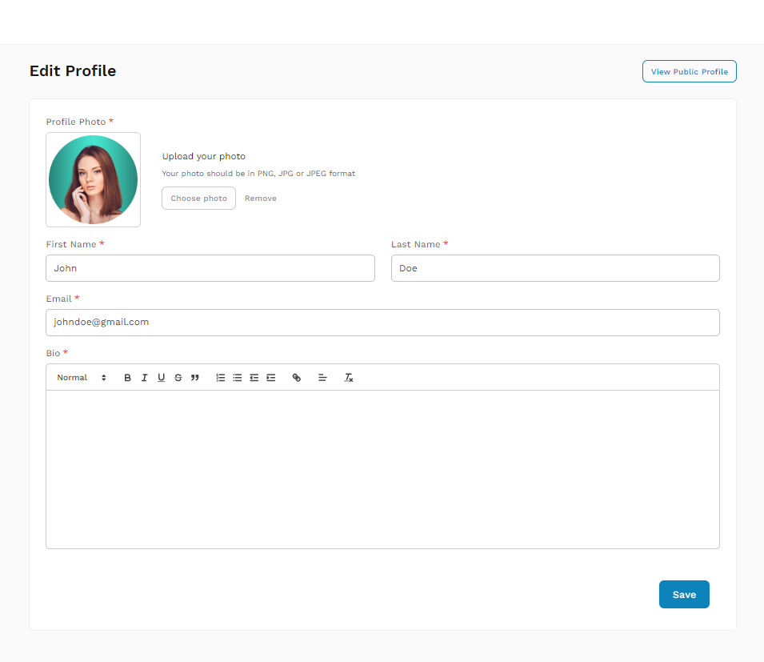
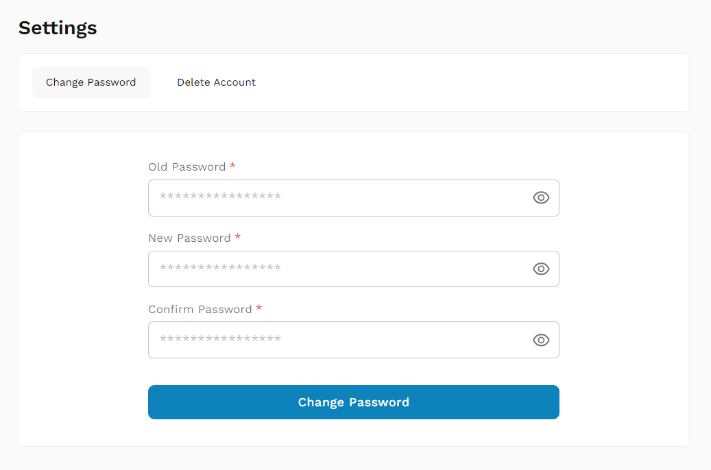
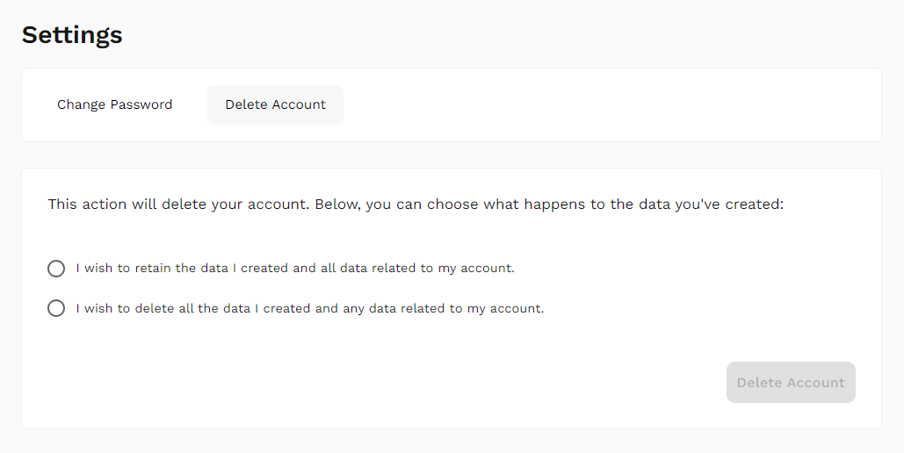

### Profile Customization

1. **Open Profile Settings:** Click on your profile icon and select 'Profile'.
2. **Edit Profile:** Update your profile details such as profile picture, bio, and contact information.
3. **Save Changes:** Click 'Save' to apply changes.

### Password Change

1. **Access Security Settings:** On the sidebar, find and click on 'Settings'.
2. **Change Password:** Enter your current password and then your new password twice for confirmation.
3. **Confirm Changes:** Click 'Change Password' to update your password.

### Delete Account

1. **Access Security Settings:** In the sidebar, click on 'Settings,' then navigate to 'Delete Account.'
2. **Follow Instructions:** Follow the prompts provided to complete the account deletion process.
