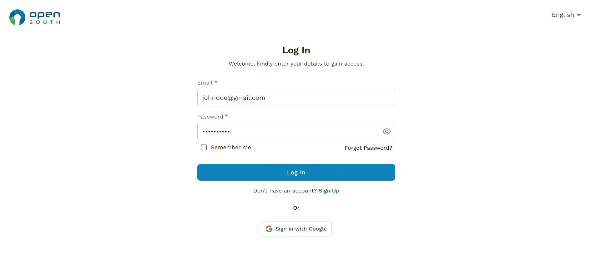
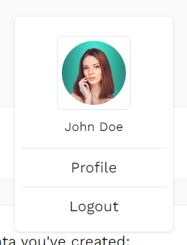

# Logging In

### Manual Login

1. **Go to the Login Page:** Click the 'Login' button on the homepage.
2. **Enter Credentials:** Enter your username and password.
3. **Access the Account:** Click the 'Log In' button to access your dashboard.

#### OR

### Sign in with Google

1. **Select Google Login:** Choose the 'Sign in with Google' option located below the 'Log In' button.
2. **Google Account Selection:**

- If you are not already logged into a Google account, you will be prompted to enter your Google email and password.
- If you are logged in with multiple Google accounts, select the one you want to use for signing into the platform.

3. **Permissions and Consent:**

- Review the permissions requested by Open South to access your Google account details necessary for the login process.
- Click 'Allow' to grant these permissions if you agree to the terms.

4. **Complete the Sign-In:** After granting permissions, Google will authenticate your credentials and redirect you back to the Open South platform.
5. **Access the Account:** You will be automatically logged into your account and redirected to your dashboard.

# Logging Out

1. **Navigate to Account Settings:** Click on your profile picture or name in the top corner.
2. **Logout:** Select the 'Logout' option from the dropdown menu to safely log out of your account.
