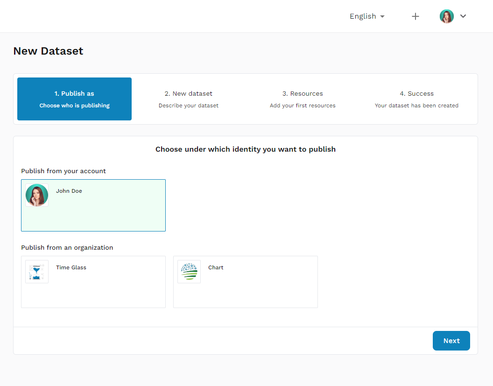

1. **Navigate to the Data Upload Page:**

   - Log in to your account.
   - Click on the 'Add a dataset' option from the main menu.

2. **Publish as:**

   - **Choose who is publishing:** Select whether you are publishing from your account or on behalf of an organization.

   - Click 'Next' to proceed.

3. **New Dataset:**

   - **Describe your dataset**

     **Title:**

     - Provide a clear and concise title for your dataset.

     **Description:**

     - Write a detailed description of your dataset, including its purpose, content, and any relevant context. Use the rich text editor to format your description for better readability.

     **License:**

     - Select the appropriate license for your dataset from the dropdown menu. To learn more about licensing options and what they entail, [click here to read more.](https://creativecommons.org/share-your-work/cclicenses)

     **Update Frequency:**

     - Indicate how often the dataset is updated by selecting an option from the dropdown menu. If unsure, you can select 'Unknown.'

     **Tags:**

     - Add relevant tags to categorize your dataset and improve its discoverability. Enter a tag name and press 'Enter' to add it.

     **Temporal Coverage:**

     - Specify the time period that the dataset covers by entering the start and end dates in the provided fields.

     **Category:**

     - Select a category that best describes the dataset from the dropdown menu.

     **Spatial Coverage:**

     - Describe the geographic area that the dataset covers. This is the specific country where the dataset was collected.

     **Agreement:**

     - By proceeding, you agree to Open South's **Data Provider Agreement**. Make sure to read and understand the terms before continuing.

     **Next Step:**

     - Once all the required fields are completed, click the 'Next' button to proceed to the 'Add your first resources' step.

4. **Resources:**

   - **Add your first resources:** Click the 'Choose File' button to upload the dataset file from your computer.
   - The allowed file types include csv, .json, .xlsx, .zip.
   - Click 'Upload' to add the file to your dataset.

5. **Success:**

   - Once the dataset has been successfully uploaded and all required information is provided, you will see a confirmation message indicating that your dataset has been created.
